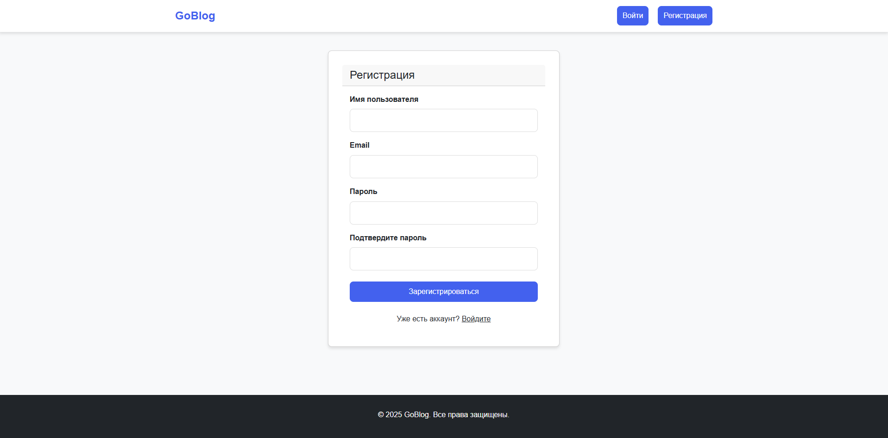
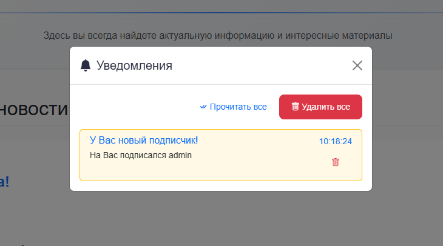
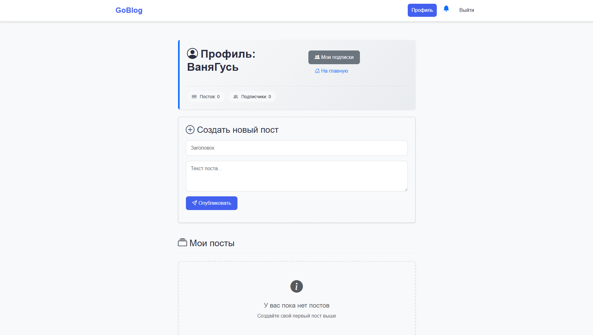

# 🚀 GoBlog — Modern Blogging Platform in Go

**GoBlog** — это высокопроизводительный бэкенд для блоговой платформы, написанный на **Go** с использованием **PostgreSQL** и **JWT-аутентификации**. Проект создан в учебных целях, но реализован с применением production-ready практик.

---

## 🔥 Особенности

✅ **REST API** для управления постами, пользователями и аутентификацией  
✅ **JWT-аутентификация** с защищёнными роутами  
✅ **PostgreSQL** для надёжного хранения данных  
✅ **Middleware** (логирование, JWT-валидация)  
✅ **Конфигурация через `.env`**  
✅ **Чистая архитектура** (разделение на handlers, models, storage)  

---

## 🛠 Технологии

- **Язык**: Go 1.22   
- **База данных**: PostgreSQL 
- **Аутентификация**: JWT  
- **Конфигурация**: `.env`  
- **Логирование**: Встроенное + (планируется Zap)  

---

## 🚀 Быстрый старт

git clone https://github.com/Ijne/GoBlog.git
cd GoBlog/core-api_app
go run cmd/server/main.go

    ИЛИ

app.exe

